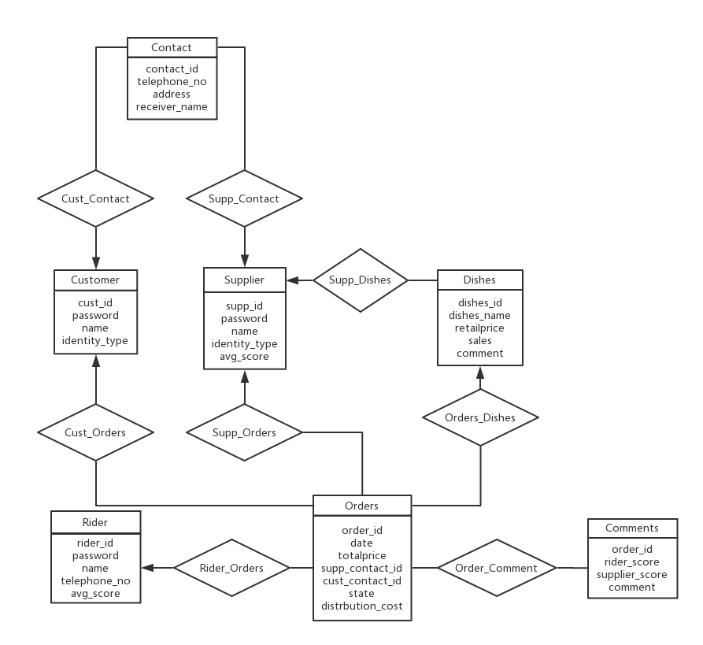
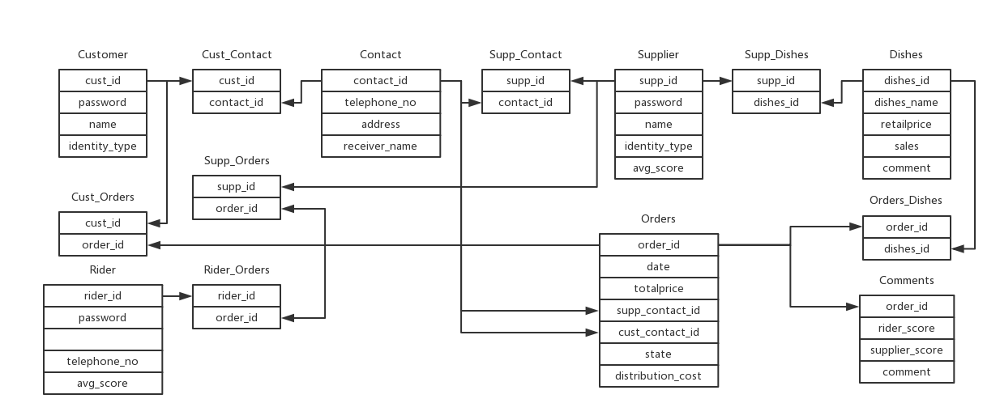

# DB-big-project
### 外卖订单

---

- 主体：

  - 用户
  - 商家
  - 订单
  - 商品
  - 联系表
  - 骑手
  - 评价

---

- 用户：

  - 用户ID(varchar(20))，密码（加密）(char(40))，用户名(nvarchar(20))，身份属性(int)。
- 商家：

  - 商家ID，密码（加密），商家名，身份属性，平均分数(numeric(2, 1))。 
- 订单：

  - 订单ID(varchar(16))，时间(date)，金额(real)，商家联系表ID(varchar(16))，用户联系表ID(varchar(16))，订单状态(varchar(10))，配送费(real)。
- 商品：

  - 商品ID(varchar(16))，商品名字(nvarchar(20))，金额(real)，销售量(int)，comment(nvarchar(50))。
- 联系表：

  - 联系表ID(varchar(16))，电话(char(11))，地址(nvarchar(50))，收件人名字(nvarchar(20))。
- 骑手：
  - 骑手ID(varchar(16))，密码(加密)，骑手名字(nvarchar(20))，电话(char(11))，平均分数)。
- 评价：
  - 订单ID（外码）(varchar(16))，骑手分数(int)，商家分数(int)，comment(nvarchar(50))。

---

- 用户（商家）-联系表（1...n）：
  - 用户（商家）ID，身份属性，联系表ID。
- 商家-商品（1...n）：
  - 商家ID，商品ID。
- 用户-订单（1...n）：
  - 用户ID，订单ID。
- 商店-订单（1...n）:
  - 商家ID，订单ID。
- 订单-商品（1...n）：
  - 订单ID，商品ID。

- 骑手-订单（1...n）：
  - 骑手ID，订单ID。

---

E-R图：

模式图：

---

订单处理流程：

------

用户自定义完整性：

* 属性约束
  * Customer.identity_type = 1
  * Supplier.identity_type = 0
  * Orders.state in ('to_do', 'to_deliver', 'delivering', 'done') && Orders.state != null

* 触发器

  * TRI_Comment_Score_INSERT

    Supplier.avg_score = SUM(Comments.supplier_score) / COUNT(Comments.order_id)

    Rider.avg_score = SUM(Comments.rider_score) / COUNT(Comments.order_id)

  * TRI_Orders_Dishes_INSERT

    Orders.totalprice = SUM(Dishes.retailprice) + Orders.distribution_cost